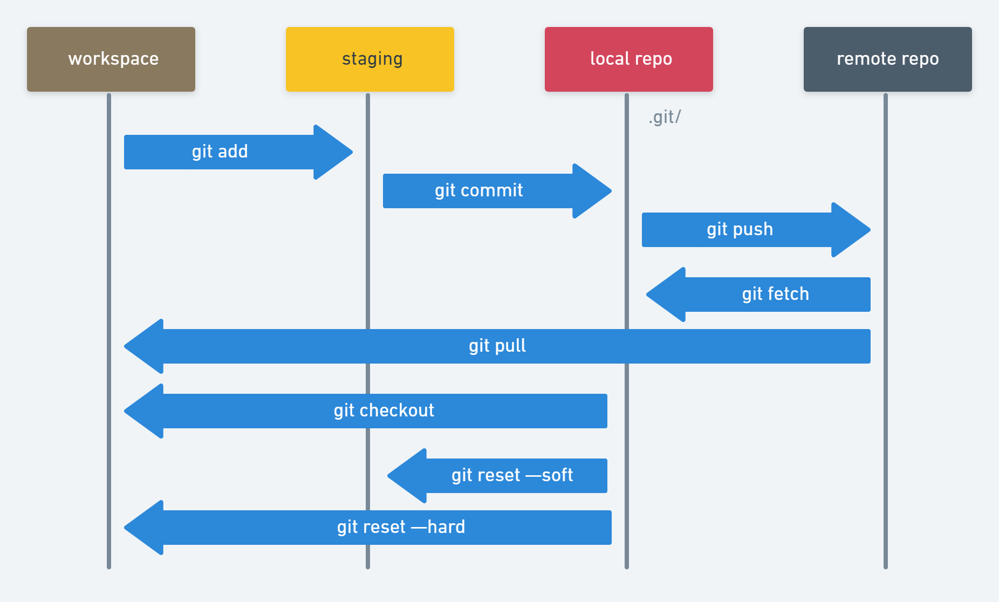

# Agile Planning

## Problem with Tradintional Waterfall Development


Requirements -> Design -> Code -> Intergration -> Test -> Deploy

* Each step ended when the next begins
* Mistakes found in the later stages are more expensive to fix
* No provisions for changing requirements
* No idea if it works until the end


* There was usually a long time between software releases
* Because all of the teams worked separately, the development team was not always aware of operational roadblocks that might prevent the program from working as anticipated
* The people the furthest from the code who knew the least about it were deploying it into production

## 12 Principles Behind the Agile Manifesto

1. Our highest priority is to satisfy the customer through early and **continuous delivery** of valuable software.
2. **Welcome changing requirements**, even late in development. Agile processes harness change for the customer's competitive advantage.
3. Deliver working software frequently, from a couple of weeks to a couple of months, with a preference to the **shorter timescale**.
4. Business people and developers must **work together** daily throughout the project.
5. Build projects around **motivated individuals**. Give them the environment and support they need, and **trust** them to get the job done.
6. The most efficient and effective method of conveying information to and within a development team is **face-to-face** conversation.
7. **Working software** is the primary measure of progress.
8. Agile processes promote **sustainable development**. The sponsors, developers, and users should be able to maintain a constant pace indefinitely.
9. Continuous attention to **technical excellence** and good design enhances agility.
10. Simplicity: the art of maximizing the amount of work not done is essential.
11. The best architectures, requirements, and designs emerge from **self-organizing teams**.
12. At regular intervals, the **team reflects** on how to become more effective, then tunes and adjusts its behavior accordingly.

## What Agile is not...

* Agile is not a new version of a waterfall SDLC, where you do legacy development in sprints
* Agile is not just the development team in each sprint, like you do in waterfall development.
* The Agile Manifesto does not include the term “agile project management” (and so there are no "project managers" in Agile)

## Agile Development

Cycle: ... -> Requirements -> Plan -> Design -> Develop -> Release -> Track & Monitor -> ...

* Requirements and solutions evolve through the collaborative effort of **self-organizing** and **cross-functional** teams and their customers
* It advocates **adaptive planning**, evolutionary development, early delivery, and **continual improvement**
* It encourages rapid and flexible **response to change**

## Agile and Scrum

**Scrum** is the most popular Agile development **framework**.

* **Agile** is a PHILOSOPHY for doing work, not prescriptive.
* **Scrum** is a METHODOLOGY for doing work that adds PROCESS to Agile thinking

### Scrum

* A management **framework** for incremental product development using one or more small cross-functional, self-organizing teams
* Provides a **structure** of roles, meetings, rules, and artifacts
* Uses fixed-length **iterations**, called Sprints, which are typically two weeks long: Scrum teams attempt to build a potentially shippable (properly tested) product increment every iteration

### Ingredients of Scrum

* Roles: Product Owner + Development Team + Scrum Master
* Artifacts: Product Backlog + Sprint Backlog + Done Increment
* Events: Sprint Planning + Daily Scrum + Sprint Review + Sprint Retrospective + Sprint

### Benefits of Scrum

Organizations that have adopted agile Scrum have experienced:

* Higher productivity
* Better-quality products
* Reduced time to market
* Improved stakeholder satisfaction
* Better team dynamics
* Happier employees

### Organization of Scrum Teams

* Small team (7 ± 2)
* Dedicated
* Co-located
* Cross-functional
* Self managing

### Scrum Roles: Product Owner, Scrum Master...

#### Product Owner

* Represents the stakeholder interests
* Responsible for **product vision**
* Final arbiter of requirements questions
* Constantly **re-prioritizes** the Product Backlog, adjusting any expectations such as release plans
* Accepts or rejects each product increment
* Decides whether to ship
* Decides whether to continue development
* May contribute as a team member

#### Scrum Master (Agile Coach)

* Facilitates the Scrum process
* Creates an environment conducive to team self-organization
* **Shields the team** from external interference and distractions to keep it "in the zone"
* Helps **resolve impediments**
* Enforces Sprint timeboxes
* Captures empirical data to adjust forecasts
* Has no management authority over the team (anyone with authority over the team is by definition not its ScrumMaster)

#### Scrum Team

* **Cross-functional** (e.g., includes members with testing skills, and often others not traditionally called developers: business analysts, domain experts, etc.)
* Self-organizing / **self-managing**, without externally assigned roles
* Consists of 5 ± 2 **dedicated co-located** collaborative members
  * Most successful when located in one team room, particularly for the first few Sprints
  * Most successful with long-term, full-time membership. Scrum moves work to a flexible learning team and avoids moving people or splitting them between teams.
* **Negotiates commitments** with the Product Owner — **one Sprint at a time**
* Has **autonomy** regarding how to reach commitments

### The Agile Dilemma

While Agile improved the speed and accuracy of software for developers, it did nothing for operations. Many development teams just got frustrated by ops not being able to deliver at the speed of development.

### Goal of Agile and DevOps are Aligned

| The Goal of Agile             | The Goals of DevOps                                                                      |
| ----------------------------- | ---------------------------------------------------------------------------------------- |
| Develop software faster       | Accelerate time to market                                                                |
| Be responsive to changes      | Improve IT’s value by more closely aligning development, IT operations, and the business |
| Obtain higher quality results | Increase IT productivity                                                                 |

### Agile Antipatterns

You will fail if you...

* Lack of real Product Owner
* If your teams are too large
* If your teams and not dedicated
* If your teams are geographically distributed
* If you teams siloed
* If your teams are not self managing

## Transform to DevOps/Agile

### Bad Formulas Leading to Failure

* Product Manager becomes Product Owner
* Project Manager becomes Scrum Master
* Developers become Scrum Team

### Comparing Traditional and DevOps/Agile Roles

| Role             | Traditional IT                                                                                   | Role          | Agile IT                                                                                                                                                                            |
| ---------------- | ------------------------------------------------------------------------------------------------ | ------------- | ----------------------------------------------------------------------------------------------------------------------------------------------------------------------------------- |
| Product Manager  | Business person who manages the budget and doesn't really need to be technical                   | Product Owner | Visionary that leads the team in a series of experiments design to achieve the goal. Conduit between the stakeholders and the team translating between business and technical goals |
| Project Manager  | Task Master that keeps everyone marching to a fixed plan. Documents impediments as project risks | Scrum Master  | Coach that keeps the team focused on the current sprint and eliminating impediments while buffering team from interruptions                                                         |
| Development Team | Made up of developers only                                                                       | Scrum Team    | Cross-functional team consisting of developers, testers, security, business analysts, operations, etc.                                                                              |

## Agile Tenets

Agile takes ideas from Lean Manufacturing and Extreme Programming (XP)

* Working in Small Batches
* Creating Minimum Viable Products (MVP)
* Using Behavior Driven Design (BDD) to make sure that you are building the right&#x20;
* Practicing Test Driven Development (TDD) to make sure that you are building the thing right
* Pair Programming to improve code quality and knowledge saturation

## Minimum Viable Product

* MVP is NOT the result of "Phase 1" of a project
* It IS the cheapest/easiest thing you can build to start testing your **value hypothesis** and **learning**
* The former focuses on delivery, while the latter focuses on learning
* At the end of each MVP you decide whether to pivot or persevere

### What is Agile Development?

* Agile is an _iterative_ approach to software development consistent with the Agile Manifesto
* Emphasizing flexibility, interactivity, and a high level of transparency
* Using **small**, **co-located**, **cross-functional**, **self-organizing** teams.

## Spotify: Case Study

### Organizational Structure

* **Squads** are grouped into Tribes (light-weight matrix)
* **Chapters** of competency areas are formed across Squads
* **Guilds** are informal light-weight community of interests across the company

### Autonomous Squads

* Each Squad has its own mission aligned with the business
  * Feels like a ”mini-startup”
  * Self organizing / Cross-funcitonal
  * 5-7 engineers, less than 10
* Squads have end-to-end reponsibility for what they build
  * Build, commit, deploy, maintenance, operations, EVERYTHING!
  * With a long term mission usually around a single business domain

### Spotify’s Changes to Scrum

* Renamed **Scrum Master** to **Agile Coach**: Because they wanted servant leaders vs process masters
* Renamed **Scrum Team** to **Squad**: Because their key driving force is Autonomy

## Why is Autonomy Important?

* It’s motivating... and motivated people build better stuff
* Autonomy is fast — letting decisions happen locally in the squad
* It minimizes hand-offs and waiting so you don’t get bogged down

## Why Use ZenHub?

* Helps you manage where you are in project based on GitHub Issues
* Gives you an easy way to let management know how you are doing
* Because it’s integrated with GitHub, it is always up to date
* Developers only need to use one tool: GitHub

## What is Kanban?

A Japanese manufacturing system in which the supply of components is regulated through the use of an instruction card sent along the production line. It is an instruction card used in a kanban system.

### Core Principles of Kanban

* **Visualize the workflow**: You cannot manage what you cannot see. By making all the work visible, including blockers and queues, you can identify issues early on and improve collaboration.&#x20;
* **Limit work in progress (WIP)**: Work in progress limits (WIP limits) determine the minimum and maximum amount of work for each column on the board or for each workflow.&#x20;
* **Manage and enhance the flow**: Ideally, you want a fast, smooth flow, which shows that the team is creating value quickly. The team should analyze problems in the flow then implement changes.&#x20;
* **Make process policies explicit**: Everyone needs to understand how things work or what “done” really means. You can modify the board to make these processes more clear; for example, you could redesign it to specify how the work should flow.
* **Continuously improve**: Teams measure their effectiveness by tracking flow, measuring cycle time, and increasing quality of work.

### Scrum vs Kanban

|                     | Scrum                                                                                                                               | Kanban                                                           |
| ------------------- | ----------------------------------------------------------------------------------------------------------------------------------- | ---------------------------------------------------------------- |
| Cadence             | Regular fixed length sprints (ie, 2 weeks)                                                                                          | Continuous flow                                                  |
| Release methodology | At the end of each sprint if approved by the product owner                                                                          | Continuous delivery or at the team's discretion                  |
| Roles               | Product owner, scrum master, development team                                                                                       | No existing roles. Some teams enlist the help of an agile coach. |
| Key metrics         | Velocity                                                                                                                            | Cycle time                                                       |
| Change philosophy   | Teams should strive to not make changes to the sprint forecast during the sprint. Doing so compromises learnings around estimation. | Change can happen at any time                                    |

## Default ZenHub Pipelines

* **New Issues** is the landing point for new Issues. Anyone can create new Issues. They should be triaged weekly.
* **Icebox** represents items that are a low priority. This keeps them out of the way of current work while not forgetting about them entirely.
* **Product** Backlog represents an ordered list of groomed stories ready too be added to the next sprint.
* **Sprint Backlog** is a prioritized backlog of items ready for development. The higher an issue is on this list, the higher the priority. Higher-priority items will typically have more in-depth information.
* **In Progress**: This is what is actively being worked on. Each Issue in this pipeline should have an assigned owner who is responsible for its completion. This communicates to the rest of the team that the task is underway.
* **Review/QA: **Issues that are open to the team for review and testing. Usually this means the code is deployed and ready for further examination.
* **Done**: Issues in this pipeline need no further work and are ready to be closed. Having a good ‘Definition of Done’ agreed upon before work starts on an Issue is very helpful here!

## Sprint

A Sprint is one iteration through the design, code, test, deploy cycle. Usually 2 weeks in duration but could be shorter or longer (but not too much longer... remember working in "small batches").

Every Sprint should have a Goal this way everyone knows what goal they are working towards

## Steps in the Scrum Process

.png>)

## The 5 Scrum Meetings

### Backlog Refinement Meeting

* Product Owner sorts the Product Backlog in Priority Order to meet business objectives
* The team may estimate the amount of effort they would expend to complete items in the Product Backlog and provides other technical information to help the Product Owner prioritize them
* Large vague items are split and clarified, considering both business and technical concerns
  * Sometimes a subset of the team, in conjunction with the Product Owner and other stakeholders, will compose and split Product Backlog Items before involving the entire team in estimation

### Grooming the Backlog

* Make sure that all Issues are groomed and stories are complete
* Keep the Backlog ranked by priority so that the important Issues are always on top: The priority is determined by the "**So that**" benefit statement
* Size the Issues if possible or leave to Sprint Planning

## Agile Concepts and GitHub

* Sprint -> Milestone
* Epics -> Epics
* User Stories -> GitHub Issues
* Tasks -> Markdown Checklist (`- [ ]`)
* Product backlog -> Open issues without a Milestone
* Sprint backlog --> Issues with a Milestone

## Fixed Releases are deprecated

* **Raionale**: risk == number of engineering hours since last deployement. (i.e., less hours == less risk)
* **Bottom line**: Feature deployment should be a **non-event** that happens all the time.

# GitHub Issues

Issues are the way GitHub tracks things to do.

* They could be **Features Requests**
* They could be **User Stories**
* They could be **Bug Reports**
* They could be just about anything you need them to be

# What are User Stories?

A user story represents a small piece of business value that a team can deliver in an iteration.

While traditional requirements (like use cases) try to be as detailed as possible, a user story is defined incrementally, in three stages:

1. The brief description of the need
2. The conversations that happen during backlog grooming and iteration planning to solidify the details
3. The tests that confirm the story's satisfactory completion

## INVEST acronym criteria

