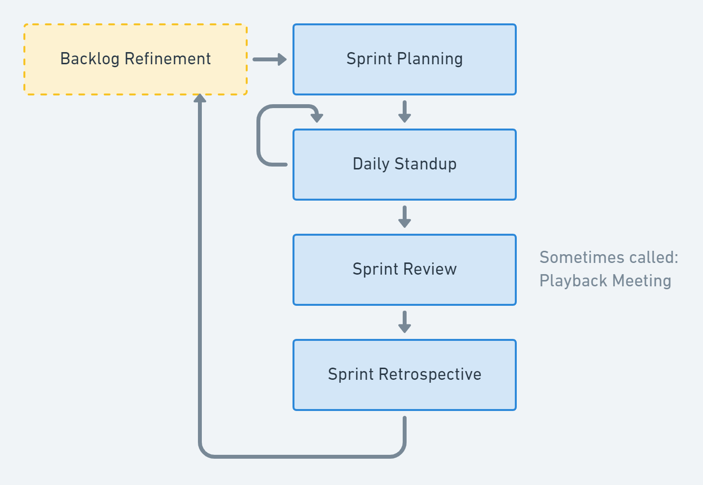

# Agile Planning

## Problem with Tradintional Waterfall Development

 Requirements -> Design -> Code -> Intergration -> Test
-> Deploy

- Each step ended when the next begins
- Mistakes found in the later stages are more expensive to fix
- No provisions for changing requirements
- No idea if it works until the end 

- There was usually a long time between software releases
- Because all of the teams worked separately, the development team was not
  always aware of operational roadblocks that might prevent the program from
  working as anticipated
- The people the furthest from the code who knew the least about it were
  deploying it into production

## 12 Principles Behind the Agile Manifesto

1. Our highest priority is to satisfy the customer through early and
   **continuous delivery** of valuable software.
2. **Welcome changing requirements**, even late in development. Agile processes
   harness change for the customer's competitive advantage.
3. Deliver working software frequently, from a couple of weeks to a couple of
   months, with a preference to the **shorter timescale**.
4. Business people and developers must **work together** daily throughout the
   project.
5. Build projects around **motivated individuals**. Give them the environment
   and support they need, and **trust** them to get the job done.
6. The most efficient and effective method of conveying information to and
   within a development team is **face-to-face** conversation.
7. **Working software** is the primary measure of progress.
8. Agile processes promote **sustainable development**. The sponsors,
   developers, and users should be able to maintain a constant pace
   indefinitely.
9. Continuous attention to **technical excellence** and good design enhances
   agility.
10. Simplicity: the art of maximizing the amount of work not done is essential.
11. The best architectures, requirements, and designs emerge from
    **self-organizing teams**.
12. At regular intervals, the **team reflects** on how to become more effective,
    then tunes and adjusts its behavior accordingly.

## What Agile is not...

- Agile is not a new version of a waterfall SDLC, where you do legacy
  development in sprints
- Agile is not just the development team in each sprint, like you do in
  waterfall development.
- The Agile Manifesto does not include the term “agile project management” (and
  so there are no "project managers" in Agile)

## Agile Development

Cycle: ... -> Requirements -> Plan -> Design -> Develop -> Release -> Track &
Monitor -> ...

- Requirements and solutions evolve through the collaborative effort of
  **self-organizing** and **cross-functional** teams and their customers
- It advocates **adaptive planning**, evolutionary development, early delivery,
  and **continual improvement**
- It encourages rapid and flexible **response to change**

## Agile and Scrum

**Scrum** is the most popular Agile development **framework**.

- **Agile** is a PHILOSOPHY for doing work, not prescriptive.
- **Scrum** is a METHODOLOGY for doing work that adds PROCESS to Agile thinking

### Scrum

- A management **framework** for incremental product development using one or
  more small cross-functional, self-organizing teams
- Provides a **structure** of roles, meetings, rules, and artifacts
- Uses fixed-length **iterations**, called Sprints, which are typically two
  weeks long: Scrum teams attempt to build a potentially shippable (properly
  tested) product increment every iteration

### Ingredients of Scrum

- Roles: Product Owner + Development Team + Scrum Master
- Artifacts: Product Backlog + Sprint Backlog + Done Increment
- Events: Sprint Planning + Daily Scrum + Sprint Review + Sprint Retrospective +
  Sprint

### Benefits of Scrum

Organizations that have adopted agile Scrum have experienced:

- Higher productivity
- Better-quality products
- Reduced time to market
- Improved stakeholder satisfaction
- Better team dynamics
- Happier employees

### Organization of Scrum Teams

- Small team (7 ± 2)
- Dedicated
- Co-located
- Cross-functional
- Self managing

### Scrum Roles: Product Owner, Scrum Master...

#### Product Owner

- Represents the stakeholder interests
- Responsible for **product vision**
- Final arbiter of requirements questions
- Constantly **re-prioritizes** the Product Backlog, adjusting any expectations
  such as release plans
- Accepts or rejects each product increment
- Decides whether to ship
- Decides whether to continue development
- May contribute as a team member

#### Scrum Master (Agile Coach)

- Facilitates the Scrum process
- Creates an environment conducive to team self-organization
- **Shields the team** from external interference and distractions to keep it
  "in the zone"
- Helps **resolve impediments**
- Enforces Sprint timeboxes
- Captures empirical data to adjust forecasts
- Has no management authority over the team (anyone with authority over the team
  is by definition not its ScrumMaster)

#### Scrum Team

- **Cross-functional** (e.g., includes members with testing skills, and often
  others not traditionally called developers: business analysts, domain experts,
  etc.)
- Self-organizing / **self-managing**, without externally assigned roles
- Consists of 5 ± 2 **dedicated co-located** collaborative members
  - Most successful when located in one team room, particularly for the first
    few Sprints
  - Most successful with long-term, full-time membership. Scrum moves work to a
    flexible learning team and avoids moving people or splitting them between
    teams.
- **Negotiates commitments** with the Product Owner — **one Sprint at a time**
- Has **autonomy** regarding how to reach commitments

### The Agile Dilemma

While Agile improved the speed and accuracy of software for developers, it did
nothing for operations. Many development teams just got frustrated by ops not
being able to deliver at the speed of development.

### Goal of Agile and DevOps are Aligned

| The Goal of Agile             | The Goals of DevOps                                                                      |
| ----------------------------- | ---------------------------------------------------------------------------------------- |
| Develop software faster       | Accelerate time to market                                                                |
| Be responsive to changes      | Improve IT’s value by more closely aligning development, IT operations, and the business |
| Obtain higher quality results | Increase IT productivity                                                                 |

### Agile Antipatterns

You will fail if you...

- Lack of real Product Owner
- If your teams are too large
- If your teams and not dedicated
- If your teams are geographically distributed
- If you teams siloed
- If your teams are not self managing

## Transform to DevOps/Agile

### Bad Formulas Leading to Failure

- Product Manager becomes Product Owner
- Project Manager becomes Scrum Master
- Developers become Scrum Team

### Comparing Traditional and DevOps/Agile Roles

| Role             | Traditional IT                                                                                   | Role          | Agile IT                                                                                                                                                                            |
| ---------------- | ------------------------------------------------------------------------------------------------ | ------------- | ----------------------------------------------------------------------------------------------------------------------------------------------------------------------------------- |
| Product Manager  | Business person who manages the budget and doesn't really need to be technical                   | Product Owner | Visionary that leads the team in a series of experiments design to achieve the goal. Conduit between the stakeholders and the team translating between business and technical goals |
| Project Manager  | Task Master that keeps everyone marching to a fixed plan. Documents impediments as project risks | Scrum Master  | Coach that keeps the team focused on the current sprint and eliminating impediments while buffering team from interruptions                                                         |
| Development Team | Made up of developers only                                                                       | Scrum Team    | Cross-functional team consisting of developers, testers, security, business analysts, operations, etc.                                                                              |

## Agile Tenets

Agile takes ideas from Lean Manufacturing and Extreme Programming (XP)

- Working in Small Batches
- Creating Minimum Viable Products (MVP)
- Using Behavior Driven Design (BDD) to make sure that you are building the
  right&#x20;
- Practicing Test Driven Development (TDD) to make sure that you are building
  the thing right
- Pair Programming to improve code quality and knowledge saturation

## Minimum Viable Product

- MVP is NOT the result of "Phase 1" of a project
- It IS the cheapest/easiest thing you can build to start testing your **value
  hypothesis** and **learning**
- The former focuses on delivery, while the latter focuses on learning
- At the end of each MVP you decide whether to pivot or persevere

### What is Agile Development?

- Agile is an _iterative_ approach to software development consistent with the
  Agile Manifesto
- Emphasizing flexibility, interactivity, and a high level of transparency
- Using **small**, **co-located**, **cross-functional**, **self-organizing**
  teams.

## Spotify: Case Study

### Organizational Structure

- **Squads** are grouped into Tribes (light-weight matrix)
- **Chapters** of competency areas are formed across Squads
- **Guilds** are informal light-weight community of interests across the company

### Autonomous Squads

- Each Squad has its own mission aligned with the business
  - Feels like a ”mini-startup”
  - Self organizing / Cross-funcitonal
  - 5-7 engineers, less than 10
- Squads have end-to-end reponsibility for what they build
  - Build, commit, deploy, maintenance, operations, EVERYTHING!
  - With a long term mission usually around a single business domain

### Spotify’s Changes to Scrum

- Renamed **Scrum Master** to **Agile Coach**: Because they wanted servant
  leaders vs process masters
- Renamed **Scrum Team** to **Squad**: Because their key driving force is
  Autonomy

## Why is Autonomy Important?

- It’s motivating... and motivated people build better stuff
- Autonomy is fast — letting decisions happen locally in the squad
- It minimizes hand-offs and waiting so you don’t get bogged down

## Why Use ZenHub?

- Helps you manage where you are in project based on GitHub Issues
- Gives you an easy way to let management know how you are doing
- Because it’s integrated with GitHub, it is always up to date
- Developers only need to use one tool: GitHub

## What is Kanban?

A Japanese manufacturing system in which the supply of components is regulated
through the use of an instruction card sent along the production line. It is an
instruction card used in a kanban system.

### Core Principles of Kanban

- **Visualize the workflow**: You cannot manage what you cannot see. By making
  all the work visible, including blockers and queues, you can identify issues
  early on and improve collaboration.&#x20;
- **Limit work in progress (WIP)**: Work in progress limits (WIP limits)
  determine the minimum and maximum amount of work for each column on the board
  or for each workflow.&#x20;
- **Manage and enhance the flow**: Ideally, you want a fast, smooth flow, which
  shows that the team is creating value quickly. The team should analyze
  problems in the flow then implement changes.&#x20;
- **Make process policies explicit**: Everyone needs to understand how things
  work or what “done” really means. You can modify the board to make these
  processes more clear; for example, you could redesign it to specify how the
  work should flow.
- **Continuously improve**: Teams measure their effectiveness by tracking flow,
  measuring cycle time, and increasing quality of work.

### Scrum vs Kanban

|                     | Scrum                                                                                                                               | Kanban                                                           |
| ------------------- | ----------------------------------------------------------------------------------------------------------------------------------- | ---------------------------------------------------------------- |
| Cadence             | Regular fixed length sprints (ie, 2 weeks)                                                                                          | Continuous flow                                                  |
| Release methodology | At the end of each sprint if approved by the product owner                                                                          | Continuous delivery or at the team's discretion                  |
| Roles               | Product owner, scrum master, development team                                                                                       | No existing roles. Some teams enlist the help of an agile coach. |
| Key metrics         | Velocity                                                                                                                            | Cycle time                                                       |
| Change philosophy   | Teams should strive to not make changes to the sprint forecast during the sprint. Doing so compromises learnings around estimation. | Change can happen at any time                                    |

## Default ZenHub Pipelines

- **New Issues** is the landing point for new Issues. Anyone can create new
  Issues. They should be triaged weekly.
- **Icebox** represents items that are a low priority. This keeps them out of
  the way of current work while not forgetting about them entirely.
- **Product** Backlog represents an ordered list of groomed stories ready too be
  added to the next sprint.
- **Sprint Backlog** is a prioritized backlog of items ready for development.
  The higher an issue is on this list, the higher the priority. Higher-priority
  items will typically have more in-depth information.
- **In Progress**: This is what is actively being worked on. Each Issue in this
  pipeline should have an assigned owner who is responsible for its completion.
  This communicates to the rest of the team that the task is underway.
- **Review/QA:** Issues that are open to the team for review and testing.
  Usually this means the code is deployed and ready for further examination.
- **Done**: Issues in this pipeline need no further work and are ready to be
  closed. Having a good ‘Definition of Done’ agreed upon before work starts on
  an Issue is very helpful here!

## Sprint

A Sprint is one iteration through the design, code, test, deploy cycle. Usually
2 weeks in duration but could be shorter or longer (but not too much longer...
remember working in "small batches").

Every Sprint should have a Goal this way everyone knows what goal they are
working towards

## Steps in the Scrum Process

.png>)

## The 5 Scrum Meetings



### Backlog Refinement Meeting

- Product Owner sorts the Product Backlog in Priority Order to meet business
  objectives
- The team may estimate the amount of effort they would expend to complete items
  in the Product Backlog and provides other technical information to help the
  Product Owner prioritize them
- Large vague items are split and clarified, considering both business and
  technical concerns
  - Sometimes a subset of the team, in conjunction with the Product Owner and
    other stakeholders, will compose and split Product Backlog Items before
    involving the entire team in estimation

### Mechanics of Backlog Refinement

- Goal: At the end of Backlog Refinement the New Issues column is empty
- Take Stories from New Issues and:
  - Move them into the ranked Backlog if they will be worked on soon
  - Move them into the Ice Box if they are a good idea but not now
  - Reject them if they are not where you want to go
- Groom the Backlog by ranking the Stories in order of importance and making
  sure the story contains enough information for a developer to start working on
  it

### Grooming the Backlog

- Make sure that all Issues are groomed and stories are complete
- Keep the Backlog ranked by priority so that the important Issues are always on
  top: The priority is determined by the "**So that**" benefit statement
- Size the Issues if possible or leave to Sprint Planning

## Agile Concepts and GitHub

- Sprint -> Milestone
- Epics -> Epics
- User Stories -> GitHub Issues
- Tasks -> Markdown Checklist (`- [ ]`)
- Product backlog -> Open issues without a Milestone
- Sprint backlog --> Issues with a Milestone

## Fixed Releases are deprecated

- **Rationale**: risk == number of engineering hours since last deployment.
  (i.e., less hours == less risk)
- **Bottom line**: Feature deployment should be a **non-event** that happens all
  the time.

## GitHub Issues

Issues are the way GitHub tracks things to do.

- They could be **Features Requests**
- They could be **User Stories**
- They could be **Bug Reports**
- They could be just about anything you need them to be

## What are User Stories?

A user story represents a small piece of business value that a team can deliver
in an iteration.

While traditional requirements (like use cases) try to be as detailed as
possible, a user story is defined incrementally, in three stages:

1. The brief description of the need
2. The conversations that happen during backlog grooming and iteration planning
   to solidify the details
3. The tests that confirm the story's satisfactory completion

### INVEST acronym criteria

| Criterion       | Remark                                                                                                                                                            |
| --------------- | ----------------------------------------------------------------------------------------------------------------------------------------------------------------- |
| **I**ndependent | We want to be able to develop in any sequence                                                                                                                     |
| **N**egotiable  | Avoid too much detail; keep them flexible so the team can adjust how much of the story to implement                                                               |
| **V**aluable    | Users or customers get some value from the story                                                                                                                  |
| **E**stimable   | The team must be able to use them for planning                                                                                                                    |
| **S**mall       | Large stories are harder to estimate and plan. By the time of iteration planning, the story should be able to be designed, coded, and tested within the iteration |
| **T**estable    | Document acceptance criteria, or the definition of done for the story, which lead to test cases                                                                   |

### Story Driven Development

- User Stories document a persona requesting a function to achieve a goal
- The typical form is as follows:

```
As a <some role>
I need <some function>
So that <I get some benefit>
```

- User Stories can be entered into GitHub as **Issues**

### Define Done / Acceptance Criteria

I like to include the following in each User Story:

- **Assumptions**: List any assumptions about how to implement the Story
- **Acceptance Criteria**: Define what it means to be "done"

### Hypothesis Driven Development

Hypotheses pair a statement that asserts or predicts value with a testable
condition that can be measured.

The typical form is as follows:

```
We believe that <function>
Will lead to <outcome>
And this will be proven when <measurable condition>
```

Where possible, the signal that is being measured should be an actionable metric
and not a vanity metric

## Technical Debt

Technical debt is anything you need to do that doesn't involve creating a new
feature. Technical debt builds up when you take shortcuts.

Examples of Technical Debt: Code refactoring, Setup and maintenance of
environments, Changing technology like databases.

## Sprint Planning

Attendees: Product Owner, Scrum Master, Development Team

- The Product Owner is responsible for declaring which Product Backlog Items are
  the most important to the business during Backlog Refinement.
- The Development Team looks at the latest product Increment, projected
  velocity, and past performance. Based on the data, the Development Team
  forecast what can be achieved.
- The team Assigns work from the Product Backlog to the Sprint Milestone.
- Plan to spend 4 hours for a 2 week sprint.

### Steps for creating a Sprint Plan

1. Create a Milestone for the Sprint
2. Assign Issues from the Backlog to the Milestone
3. Filter ZenHub by the Milestone to work the plan

### Sprint Planning Goals

- Each Sprint should have a clearly defined Business Goal.
- The Product Owner comes with a proposal of the Sprint Goal and Product Backlog
  Items supporting it.
- The whole Scrum Team collaborates on crafting the Sprint Goal, so everybody
  understands why we are building the Increment.

### Mechanics of Sprint Planning

- Take Issues from the top of the ranked Backlog and assign them to the Sprint
  Milestone
- Groom the Story by clarifying and assigning Story Points, Labels, and making
  sure the story contain enough information for a developer to start working on
  it
- Stop adding Stories when your team’s Velocity is reached

### Team Velocity

The number of Story Points a team can complete in a single Sprint. This will
change over time as the team gets better at estimating and better at executing.
The Velocity is unique to the team because the story point assignment is unique
to the team

### Story Points

- Story Points acknowledge the fact that sizing using absolute time-to-complete
  is highly inaccurate so it uses an estimate of complexity
- It is measurement of a feature’s size **relative** to other features usually
  expressed in T-Shirt sized (S, M, L, X) or Fibonacci numbers (1, 2, 3, 5, 8,
  13, 21)
- The important thing is to agree on "average" and evaluate from that (i.e., is
  it the same, larger, or smaller than average)

### A Story Point Measures...

Effort, Complexity and Uncertainty.

### What Size Should A User Story Be?

- A Story should be small enough to be coded and tested within a single Sprint
  iteration — ideally just a few days
- When a Story is too large in scope it is considered to be an **Epic**
- Backlog items tend to start as Epics when they are lower priority and less
  defined
- For sprint planning, Epics should be broken down into smaller stories, but not
  so small that you have moved into detailed design.

### Epics

- Epics are Stories that are so big, they need to be broken up into smaller
  Stories
  - A single Story should be smaller than a Sprint
  - Epics are usually larger than a Sprint
- Epics are a way of grouping Stories with a common goal together
- Epics can be larger than a Milestone

## Daily Standup

Attendees: Scrum Master, Development Team, Product Owner (optional)

- Occurs every day at the same time and place
- Called a "standup" because everyone should remain standing during the meeting
  to keep it short
  - Timeboxed to 15 minutes
  - Not a project status meeting — all status should be tabled for later
    discussion
- Each team member briefly reports on their work

### Daily Standup Questions

Each team member answers three questions:

1. What did I accomplish the previous day?
2. What will I work on today?
3. What blockers or impediments are in my way?

## Daily Execution

- Take the next highest priority item from the Sprint Backlog
- Assign it to yourself
- Start working on it
- No one should have more than one story assigned to them unless they are
  blocked and want to start a second story while waiting
- When you are finished, move the Story to the Done column

## Milestones and Burn-downs

**Milestones** can be created for your project, e.g. Sprint, Beta Drop, Demo,
Release 1, etc.

**Burn-down charts** can be used to measure your progress against a Milestone.

### Burn-down

The measurement of Story Points completed vs Story Points remaining for a given
Sprint. Over time the Story Points remaining should go down, hence the name:
Burndown.

## Sprint Review / Playback

Attendees: Product Owner, Scrum Master, Development Team, (optionally
Stakeholders + Customers)

- Live Demonstration of implemented Stories
- Product Owner determines if done based on acceptance criteria and those
  stories are Closed
- Feedback gets converted into new Product Backlog Stories
  - This is where iterative development allows the creation of products that
    couldn’t have been specified up front in a plan-driven approach

## Sprint Retrospective

Attendees: Scrum Master, Development Team

- Team reflects on their progress for the Sprint
  - What went well? (keep doing)
  - When did not go well? (stop doing)
  - What should we change for the next Sprint?
- This is critical for maintaining a healthy team

## Vanity Metrics

- Consider the total number of daily “hits” to your website is 10,000
- Now what? (what does a "hit" represent?)
  - Do you really know what actions you took in the past that drove those
    visitors to you?
  - Do you really know which actions to take next?
  - In most cases, I don’t think it’s very helpful

### Actionable Metric Examples

- Reduce time-to-market for new features.
- Increase overall availability of the product.
- Reduce the time it takes to deploy a software release.
- Increase the percentage of defects detected in testing before production
  release.
- Make more efficient use of hardware infrastructure.
- Provide performance and user feedback to the product manager in a more timely
  manner.

### Top 4 Actionable Metric

1. **Mean Lead Time**: How long does it take from idea to production?
2. **Release Frequency**: How often can you deliver changes?
3. **Change Failure Rate**: How often to changes fail?
4. **Mean Time to Recovery (MTTR)**: How quickly can you recover from failure?
