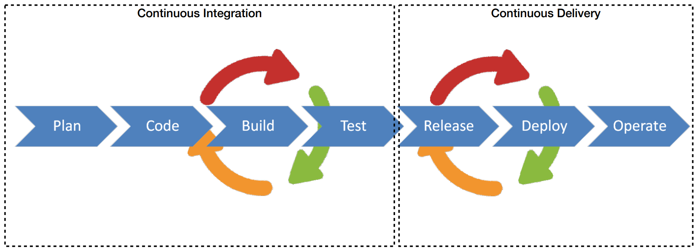
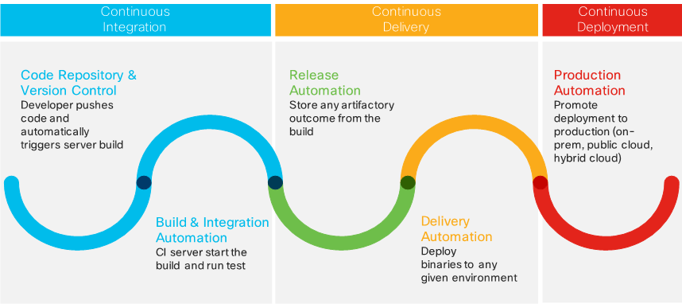

# Continuous Integration

## Continuous Integration (CI) vs Continuous Delivery (CD)

**Continuous Integration** is the process of continuously integrating every developer's change into the master branch after a set of tests have passed, resulting in potentially deployable code.

**Continuous Delivery** is a series of practices designed to ensure that code can be rapidly and safely deployed to production by delivering every change to a production-like environment.

## Traditional Development

* Developers work in long lived development branches
* Branches are periodically merged into a release (with lots of breakage)
* Build are run periodically (e.g., nightly) on release candidate branch
* Developers continue to add to the development branch which drifts further and further from the master branch

## Continuous Integration

* A development practice that requires developers to integrate code into a shared repository often (e.g., daily)
* Developers work in short lived feature branches that are merged into master
* Each check-in is then verified by an automated build, allowing teams to detect problems early and often

### Changes are kept small

* Committing regularly, every developer can reduce the number of conflicting changes: Checking in a week's worth of work runs the risk of conflicting with other features and can be very difficult to resolve
* Using Pull Requests allows team members to communicate about the change they are making
* Committing all changes at least once a day (once per feature built) is generally considered part of the definition of Continuous Integration

### Every Pull Request should be built and tested

* The system should build commits to the current working version to verify that they integrate correctly
* A common practice is to use automated Continuous Integration where a continuous integration server or daemon monitors the revision control system for changes, then automatically runs the build process
* Once the code is built, all tests should run to confirm that it behaves as the developers expect it to behave (i.e, make the build self-testing)

## Benefits of CI/CD

* Faster reaction times to changes
* Reduced code integration risk
* Higher code quality
* The code in version control works
* Less deployment time

## Five Key Principles at the heart of Continuous Delivery

* Build quality in
* Work in small batches
* Computers perform repetitive tasks, people solve problems
* Relentlessly pursue continuous improvement
* Everyone is responsible

## A CI/CD Pipeline needs...

* A code repository to host and manage all your source code
* A build server to build the application from source code
* An integration server/orchestrator to automate the build and run test code
* A repository to store all the binaries and artifacts of the application
* Tools for automatic configuration and deployment

## CI/CD + Continuous Deployment

## Automation is key but insufficient on it's own

For business to take advantage of continuous integration and continuous delivery, they must:

* Have an **application design** that allows services to be deployed quickly and independently
* Have automated all of their **testing**
* Have organizational trust that allows **autonomy** and **shared responsibility**
* Have **fast feedback loops** with minimal Mean Time to Recovery

## What is Travis CI?

* Travis CI is a Continuous Integration tool
* It allows you to treat your CI pipeline as code
* It can also do deployments for Continuous Delivery

### Continuous Delivery Goals

"Continuous Delivery is a software development discipline where you build software in such a way that the software can be released to production at any time" — Martin Fowler.

That means:

* The Master branch should always be ready to deploy
* You need a way to know if something will "break the build"

Travis CI gives you a way to achieve this.

### Know if the Build is Broken

* Automated Testing is CRITICAL to Continuous Integration
* Travis CI can work with any language and any test suite
* Lots of languages and test suite support is built-in
* Database support is built-in
* Webhooks allow Travis-CI to run on every Pull Request
* Status is delivered to the Pull Request before a merge
