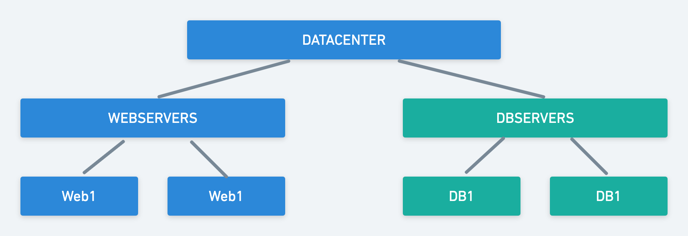

# Infrastructure as Code

Describe your infrastructure in textual format and configure them using that description

* Never perform system and software configurations manually
* Use templates / scripts describing how to install / configure systems /devices /software / users
* Configuration Management Systems make this possible

## Convergence

* Rather than describing the steps needed to make a change, the language describes the final state in which one wants to end up
* The agent then ensures that the necessary steps are taken to end up in this "policy compliant state"
* Thus, configuration can be run again and again, whatever the initial state of a system, and it will end up with a predictable result

## Agent vs Agent-less

Advantages of **Agent** based

* Rich client can do more and run on a schedule
* Low volume of network traffic

Advantages of **Agent-less** based

* Small memory footprint and support of rare systems
* No need to run an agent all the time on each server

## Ansible

### Ansible Design Principles

* Have a dead simple setup process and a minimal learning curve
* Manage machines very quickly and in parallel
* Avoid custom-agents and additional open ports, be agentless by leveraging the existing SSH daemon
* Describe infrastructure in a language that is both machine and human friendly
* Focus on security and easy auditability/review/rewriting of content
* Manage new remote machines instantly, without bootstrapping any software
* Allow module development in any dynamic language, not just Python
* Be usable as non-root
* Be the easiest IT automation system to use, ever

### Ansible Terminology

The following list contains a quick overview of the most relevant terms used by Ansible:

* **Control Node**: the machine where Ansible is installed, responsible for running the provisioning on the servers you are managing.
* **Inventory**: an INI file that contains information about the servers you are managing.
* **Playbook**: a YAML file containing a series of procedures that should be automated.
* **Task**: a block that defines a single procedure to be executed, e.g.: install a package.
* **Module**: a module typically abstracts a system task, like dealing with packages or creating and changing files.
* **Role**: a set of related playbooks, templates and other files, organized in a pre-defined way to facilitate reuse and share.
* **Play**: a provisioning executed from start to finish is called a play.
* **Facts**: global variables containing information about the system, like network interfaces or operating system.
* **Handlers**: used to trigger service status changes, like restarting or reloading a service.

### Ansible Components

**Inventory**: The list of servers and optionally variables to operate on

**Playbook**: The collection of "plays" in YAML format to operate on the servers

**Plays**: A list of tasks and handlers to execute on each targeted server

**Tasks**: Instructions to cary out the configuration

### Inventory File

* The inventory files tells Ansible what servers to act on
* Ansible allow you to place servers into groups (e.g., webservers, dbservers) and then make changes on entire groups of servers at the same time instead of changing them one-by-one
* Groups allow you to specify servers of the same type

```
web1 ansible_ssh_host=192.168.56.20
db1 ansible_ssh_host=192.168.56.30

[webservers]
web1

[dbservers]
db1

[datacenter:children]
webservers
dbservers
```

### Hierarchy of Groups



## Playbooks

* Ansible stores it’s instructions in files called "Playbooks"
* Expressed in YAML language
* Composed of one or more "plays" in a list
* Allows for multi-machine deployment orchestration

## Playbook — Tasks

* Are executed in the order they are specified against all machines that match the host pattern
* May be included from other files
* If a task fails, the remaining playbook are not executed for that host
* Each task executes a module with specific options
* Modules are idempotent in order to bring the system to a desired state

## Playbook — Handlers

* Notifications may be triggered at the end of each block of tasks that modify the remote system
* Handlers are referred to by name and can perform operations like restarting services that have had their configuration changed

```yaml
tasks:
  - name: Create template configuration file
    template: src=template.j2 dest=/etc/httpd/httpd.conf
    notify:
      - restart apache

handlers:
  - name: restart apache
    service: name=apache state=restarted
```

### Example Playbook

`python.yaml`:

```yaml
---
- name: Performing Package Maintenance on All nodes
  hosts: all
  become: yes
  tasks:
    - name: Update and upgrade local packages
      apt: upgrade=full update_cache=yes
- name: Installing Python development environment
  hosts: all
  become: yes
  tasks:
    - name: install required packages for Python using the apt module
      apt: package={{ item }} update_cache=yes
      with_items:
        - git
        - python-pip
        - python-dev
        - build-essential
```

### Roles

Based on a know file structure

```
site.yaml
webservers.yaml
roles/
  webservers/
    files/
    templates/
    tasks/
    handlers/
    vars/
    defaults/
```

`webservers.yaml`:

```yaml
---
- hosts: webservers
  roles:
    - webservers
```

### Vagrant Integration

Ansible is supported by Vagrant so that you can use the same Ansible Playbooks to configure your local VM and remote servers

```ruby
  #
  # Run Ansible using the guest plugin
  #
  config.vm.provision :guest_ansible do |guest_ansible|
    guest_ansible.playbook = "python.yaml"
    guest_ansible.extra_vars = { user: "vagrant" }
    guest_ansible.sudo = true
  end
```

### Example 1: LAMP STACK

This will install Apache, MySQL, & PHP on Linux (LAMP)

```yaml
######################################################################
# LAMP Stack Example #1
######################################################################
---
- hosts: webserver
  become: yes
  tasks:
    - name: Install MySQL server
      apt: name=mysql-server state=latest
    - name: Install Apache module for MySQL authentication
      apt: name=libapache2-mod-auth-mysql state=latest
    - name: Install MySQL module for PHP
      apt: name=php5-mysql state=latest
```

### Example 2: Same LAMP STACK but better

A better way would be to use the iteration of with\_items

```yaml
######################################################################
# LAMP Stack Example #2
######################################################################
---
- hosts: webservers
  become: yes
  tasks:
    - name: install packages
  apt: name={{item}} state=latest update_cache=yes
  with_items:
    - mysql-server
    - libapache2-mod-auth-mysql
    - php5-mysql
```
