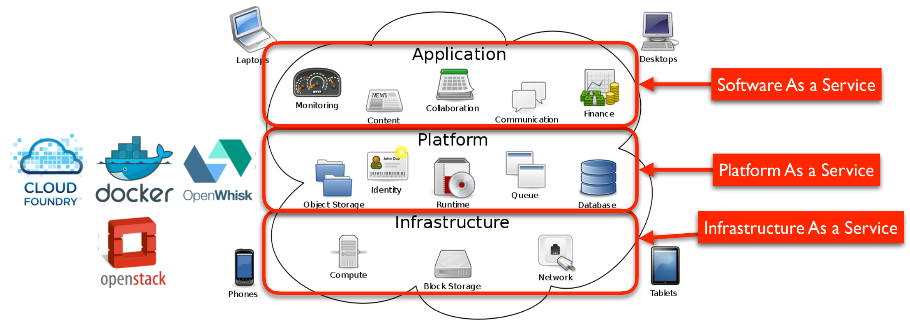
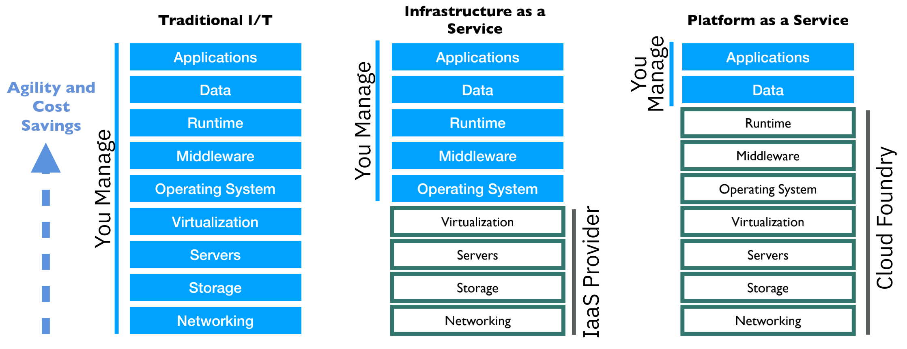

# Platform as a Service

## What is cloud computing?

### NIST Description

The National Institute of Standards and Technology (NIST) loosely describes
cloud computing as:

"A model for enabling convenient, **on-demand** network access to a **shared
pool** of **configurable computing resources**, such as networks, servers,
storage, applications, and services, that can be **rapidly provisioned and
released** with **minimal management effort** or service provider interaction."

### Characteristics

- A fundamental shift from physical infrastructure to virtual infrastructure:
  Seen as a major paradigm shift
- A rapid way of provisioning and later releasing computing services on the
  network

Some important characteristics:

- Rapid/automated provisioning and (later) release of services
- Can be Pay-as-you-go
- Appearance of infinite resources
- Could be managed or unmanaged

### Why use cloud services instead of running them yourself?

You’ll think, “if I was running my own Kafka cluster instead of using Kinesis, I
could find the issue and fix it”

That may be true, but you should remember two things:

1. That would be a distraction from creating business value
2. You would almost certainly be worse at running it. You’d have more and worse
   incidents. It’s a service provider’s purpose in life to be good at it and
   they have economies of scale you don’t.

Moving past the “I could always build it myself” attitude can be hard.

## Types of Clouds

Based on service provided

- Software as a Service (SaaS)
- Platform as a Service (PaaS)
- Infrastructure as a Service (IaaS)

Based on ownership

- Public Clouds
- Private Clouds
- Hybrid Clouds

Based on Location

- On Premise
- Off Premise

## Computing as a Service

## Types of Cloud Migration

- **Image Migration**: Save an image of the server and restore it to a virtual
  machine
- **Workload Migration**: Build a new server in the cloud and reinstall the
  application
- **Cloud Native**: Rewrite the application to take advantage of cloud
  architectures

## Cloud Enabled

- Image Migration and Workload Migration don’t take full advantage of the Cloud
- You have the same number of VM’s as you had Physical Servers
- Which means you need to manage the same number of servers in the end

## Cloud Native Applications

- The _Twelve-Factor_ App describes patterns for cloud-native architectures
  which leverage microservices
- Applications are design as a collection of stateless microservices
- State is maintained in separate databases and persistent object stores
- Resilience and horizontal scaling is achieved through deploying multiple
  instances
- Failing instances are killed and re-spawned, not debugged and patched (cattle
  not pets)
- DevOps pipelines help manage continuous delivery of services

## Microservices

An architecture style aimed to achieve flexibility, resiliency and control,
based on the following principles:

- Loose Coupling bounded context
- Independent life cycle: developed, deployed and scaled... and hopefully, fail
  independently
- Design for resiliency
- Polyglot
- Built by autonomous teams with end-to-end responsibility, doing Continuous
  Delivery

### Monolithic vs Microservices

| Monolithic                          | Microservices                       |
| ----------------------------------- | ----------------------------------- |
| Tightly coupled                     | Loosely coupled                     |
| Mixed Concerns                      | Minimal responsibility per service  |
| Large Deployment units              | Small Deployment units              |
| Hard to Scale                       | Easy to Scale                       |
| Long release cycles                 | Short release cycles                |
| Slow on-boarding for new developers | Fast on-boarding for new developers |
| Slower feedback loop                | Develop quickly with fast feedback  |

### Where to Deploy Our Microservice?

- Deploying to Virtual Machines means that you now have to manage VM’s
  - Not desirable
  - Patching, upgrading, health check, etc.
- Deploying to a Platform frees you up to only worry about your application
- Cloud Native Deployment enables agility

## IaaS vs PaaS

## Containers vs Virtual Machines

VMs:

- Virtual Machines are heavy-weight emulations of real hardware

Containers:

- Containers are light-weight like a process
- The app looks like it’s running on the Host OS

## IBM Cloud Services

### Cloud Foundry

- **Platform as a Service** for running applications
- Offers a set of run-time environments that you deploy into: Java, Python,
  NodeJS, Ruby, Go, Mobile, etc.
- Uses Heroku Buildpacks to provide environments: You can bring your own or use
  community buildbacks
- Deploying code is as easy as: cf push

#### Cloud Foundry Architecture

The Cloud Foundry platform is abstracted as a set of large-scale distributed
services.

- It uses Cloud Foundry Bosh to operate the underlying infrastructure from IaaS
  providers (e.g., VMware, Amazon AWS, OpenStack),
- Components are dynamically discoverable and loosely coupled, exposing health
  through HTTP endpoints so agents can collect state information (app status &
  system state) and act on it.

### Kubernetes

- An open-source system for automating deployment, scaling, and management of
  containerized applications.
- Groups containers that make up an application into logical units for easy
  management and discovery.
- Based on 15 years of experience of running production workloads at Google,
  combined with best-of-breed ideas and practices from the community

### Docker

Docker is a light-weight container service that runs on Linux

- File system overlay
- One Process Space
- One Network Interface
- Shares the Linux kernel

Containers encapsulate a run-time environment

- Your code, libraries, etc.

Almost no overhead

- Containers spin up in milliseconds
- Native performance because there is no emulation
- Package only what you need

### Red Hat® OpenShift

Open Source application platform based on Containers and Kubernetes. Makes the
Kubernetes experience easier for developers and operations

OpenShift Provides:

- Web Console for Developers
- Source-2-Image (S2I)
- Built-in CI/CD Pipeline
- Validated integrations (Istio, K-Native, etc.)
- Integrated container registry

### Serverless

- You don't need to provision a server
- No permanent infrastructure
- Your software only runs when it is needed
- You only pay for actual use
- Ideal for event driven environments

#### Cloud Functions with Apache OpenWhisk

OpenWhisk is a cloud-first distributed event-based programming service

- It represents an event-action platform that allows you to execute code in
  response to an event
- Provides a serverless deployment and operations model hiding infrastructural
  complexity: Simply provide the code you want to execute

Supported languages/runtimes:

- NodeJS
- Java
- Swift
- Python
- Docker

Supported Events:

- Periodic
- IBM Cloudant
- Message Hub (Kafka)
- Mobile Push
- GitHub
- IBM API Connect

### Plain Old VM’s

Sometimes you need a VM because of some unique requirement

Deploying to Virtual Machines means that you now have to manage VM’s

- Patching, upgrading, health check, etc.
- Not desirable
- Use as a last resort!

### DevOps Continuous Deployment

In order to facilitate Continuous Deployment, you want to deploy into an
environment with the least friction

- Setting up IaaS VM’s is a lot of work and leaves a large 'attack surface' for
  predators
- Platform as a Service makes deployment frictionless and more secure

## Advantages of PaaS

- **Minimal set-up** time to get coding: Developers can concentrate on the
  application and not the infrastructure
- **Large number of services** to take advantage of (Database, Messaging,
  Analytics, Mobile, etc…)
- Very **easy to scale** with demand
- Delete it if it doesn’t work out and pay nothing (or very little)
