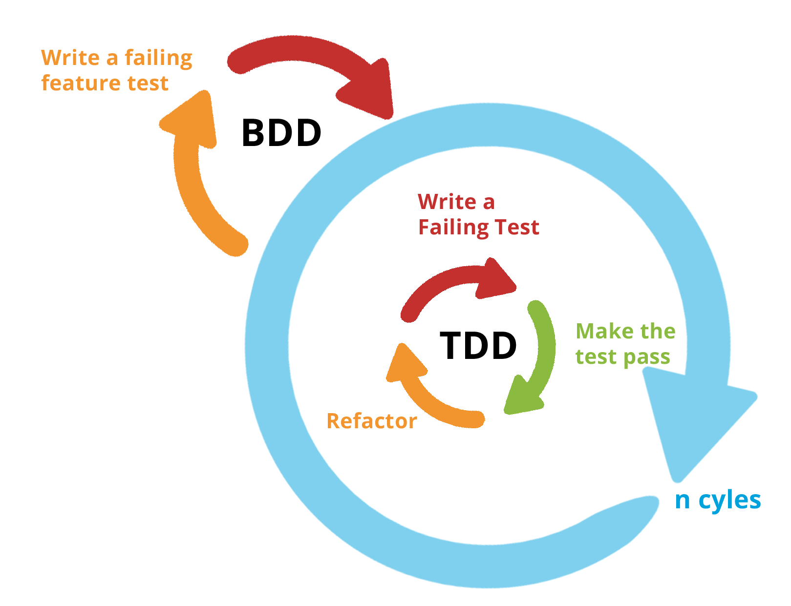

# Test Driven Development

## Why Developers Don't Test

- I already know it works!
  - Others who work on your code in the future won’t know if they broke
    something
- I don’t write broken code!
  - Sometimes the environment changes and other future libraries read your code
- I have no time!
  - Testing actually saves you time (and stress) in the long run

## Software Testing Levels

### Acceptance Testing

A level of the software testing process where a system is tested for
acceptability. The purpose of this test is to evaluate the system’s compliance
with the business requirements and assess whether it is acceptable for delivery.

### System Testing

A level of the software testing process where a complete, integrated
system/software is tested. The purpose of this test is to evaluate the system’s
compliance with the specified requirements.

### Integration Testing

A level of the software testing process where individual units are combined and
tested as a group. The purpose of this level of testing is to expose faults in
the interaction between integrated units.

### Unit Testing

A level of the software testing process where individual units/ components of a
software/system are tested. The purpose is to validate that each unit of the
software performs as designed.

## DBB & TDD

Behavior-Driven Development (BDD)

- Describes the behavior of the system from the outside in
- Used for Integration / Acceptance Testing

Test Driven Development (TDD)

- Tests the functions of the system from the inside out
- Used for unit testing

### TDD Workflow

Cycle: ... -> <span color="red">RED</span> -> <span color="green">GREEN</span>
-> <span color="blue">REFACTOR</span> -> ...

- Write a test case and watch it <span color="red">FAIL</span>
- Write the code to make it <span color="green">PASS</span>
- <span color="blue">REFACTOR</span> the code to make it great knowing that the
  test case will let you know if you broke anything

### BDD & TDD Cycle



"BDD is building the right thing, and TDD is building the thing right."

## What is TDD?

- Test Driven Development means that your test cases drive the design and
  development of your code
- You write the tests first for the code you wish you had, then you write the
  code to make the test pass
- This keeps you focused on the purpose of the code (i.e., what is it supposed
  to do)

### Why is automated Testing Important to DevOps?

- First and foremost it saves time when developing!
- It allows you to run faster because you are more confident
- It insures that your code is working as you expected
- It insures that future changes don’t break your code
- In order to use a DevOps Pipeline, all testing must be automated

### Kent Beck says Good Unit tests...

- Run fast (they have short setups, run times, and break downs).
- Run in isolation (you should be able to reorder them).
- Use data that makes them easy to read and to understand.
- Use real data (e.g. copies of production data) when they need to.
- Represent one step towards your overall goal.

### The Basic TDD Workflow

- Write a failing unit test for the code you wish you had
- Write just enough code to make the unit test pass
- Refactor the code and repeat

## Test Fixtures

A test fixture is a fixed state of a set of objects used as a baseline for
running tests.

The purpose of a test fixture is to ensure that there is a well known and fixed
environment in which tests are run so that results are repeatable.

Examples of fixtures:

- Preparation of input data and setup/creation of fake or mock objects
- Loading a database with a specific, known set of data
- Copying a specific known set of files creating a test fixture will create a
  set of objects initialized to certain states.

### Unittest Fixtures

```py
def setUpModule(): # runs once before any tests
  pass

def tearDownModule(): # runs once after all tests
  pass

class MyTestCases(TestCase):
  @classmethod
  def setUpClass(cls): # runs once before test class
    pass

  @classmethod
  def tearDownClass(cls): # runs once after test class
    pass

  def setUp(self): #runs before each tests
    pass

  def tearDown(self): # runs after each tests
    pass
```

## Mocking

- Mocking creates fake objects that behave like the real thing
- Any external service that is not under test should be Mocked
- Sometimes you need to change the behavior of a dependent system under test
- Maybe you don’t have a remote connection to another component
- Or you want to isolate your tests from a remote component

### Methods of Mocking

- **Patch**: This patches a function call allowing you to change it’s behavior
- **MagicMock**: This mocks an entire object changing it’s behavior. Usually
  used as a return value

## Factories and Fakes

Sometimes you will need fake data to test against, sometimes you will want an
entire class to be fake data, Factories and Fakes make this possible. We will
use Factory Boy in Python for this.
